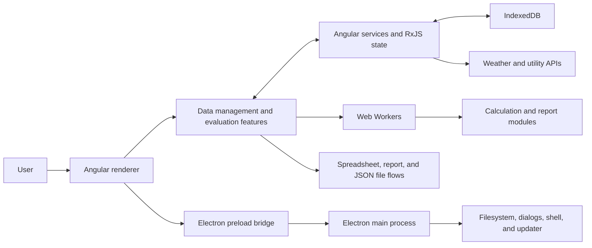
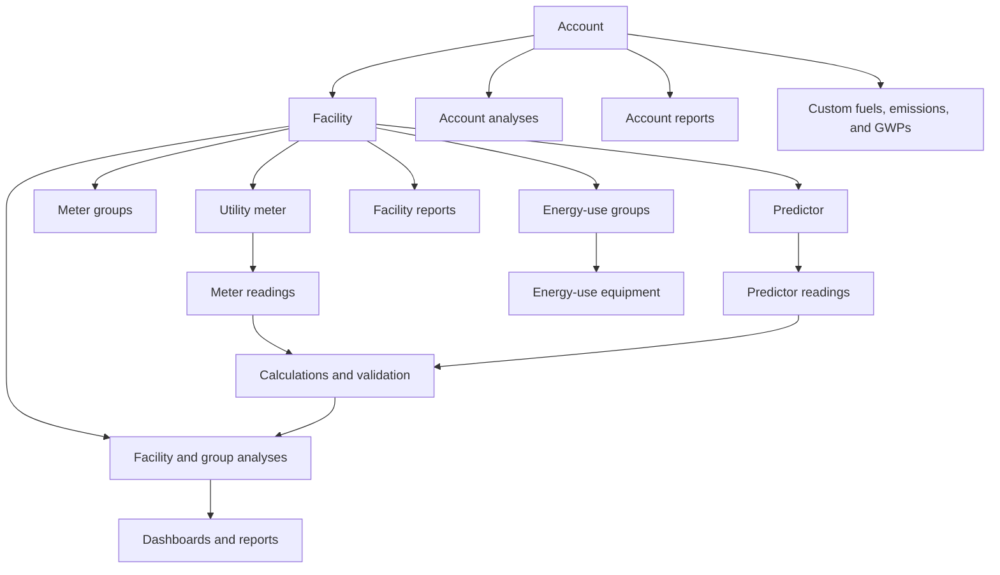

# VERIFI Architecture

This document describes the current repository. It is an orientation guide, not a proposal for a redesigned system. Follow links to source for volatile details such as package and database versions.

## System context

VERIFI is a client-focused Angular application delivered as a web application and as an Electron desktop application. Most domain data is stored locally in IndexedDB. Remote services supply weather and utility-related reference data; compute-heavy analysis and report preparation can run in Web Workers.

The Electron renderer is the same Angular application built with the Electron environment. [`main.js`](main.js) creates the desktop window, while [`preload.js`](preload.js) exposes a channel allowlist with context isolation enabled and Node integration disabled.

## Startup and application shell

[`src/main.ts`](src/main.ts) bootstraps [`AppModule`](src/app/app.module.ts). The application remains NgModule-based: `AppModule` imports feature modules for data management, data evaluation, weather data, static content, shared utilities, and IndexedDB integration.

[`AppComponent`](src/app/app.component.ts) coordinates initial loading. IndexedDB services load accounts and related records, populate service-owned `BehaviorSubject` state, apply record updates or migrations, select the active account, and start Electron-specific behavior when the preload bridge is present. This startup coupling means changes to persisted models may affect initialization even when an individual feature compiles in isolation.

Top-level routing is defined in [`src/app/routing/app-routing.module.ts`](src/app/routing/app-routing.module.ts):

- **Data management** handles account setup, facilities, meters, predictor data, imports, energy-use setup, and custom factors.
- **Data evaluation** handles account and facility dashboards, visualizations, analyses, and reports.
- **Weather data** provides station selection and annual or monthly observations.
- Shared routes provide the home page, account management, help, privacy, feedback, and other static content.

Account and facility route trees are intentionally large. Add routes alongside the relevant workflow and inspect adjacent components before changing navigation behavior.

## Domain and persistence

Persistence is configured with `ngx-indexed-db` in [`src/app/indexedDB/_dbConfig.ts`](src/app/indexedDB/_dbConfig.ts) and registered by [`IndexedDBModule`](src/app/indexedDB/indexed-db.module.ts). Each object-store service owns database operations plus observable application state for its records.

Ordinary single-store access uses `ngx-indexed-db`. Atomic operations spanning multiple stores use the internal native transaction adapter in [`indexed-db-transaction.service.ts`](src/app/indexedDB/indexed-db-transaction.service.ts). Transaction operations must use only the adapter's transaction-bound request context; calling an object-store service from inside the operation would open an unrelated transaction.

Account and facility removal are infrastructure-owned cascades in [`indexed-db-cascade-delete.service.ts`](src/app/indexedDB/indexed-db-cascade-delete.service.ts). Every participating store and retained-reference update must remain inside its declared native transaction; application subjects are refreshed only after that transaction commits.

Persisted records generally have an IndexedDB `id` used as the local key and a `guid` used for domain relationships. Account and facility GUIDs connect records across stores. Preserve that distinction in queries, imports, migrations, and deletes.

There are two independent forms of persistence evolution:

- **Structural schema changes** update `_dbConfig.ts`. Adding or changing a store or index requires an intentional database-version increment and an upgrade-path test.
- **Record-shape migrations** use `CURRENT_DATA_VERSION` and the ordered pure registry described in the [`data-migrations` guide](src/app/indexedDB/data-migrations/README.md). The local runner commits each migration and application metadata in one native transaction before startup publishes persisted records. Current-version data is not rewritten.

Test both an empty database and representative older data. Consider JSON backup import/export whenever persisted shapes change.

## Calculations, Workers, and reports

Pure TypeScript calculations live under [`src/app/calculations`](src/app/calculations). Major groups cover calendarization, analyses, conversions, emissions, energy footprints, dashboards, savings, performance reports, and validation/status checks. Shared analysis services in `src/app/shared/shared-analysis/` orchestrate some calculations for components.

Compute-heavy operations use workers under [`src/app/web-workers`](src/app/web-workers). [`run-worker.ts`](src/app/web-workers/run-worker.ts) wraps a Worker in an RxJS observable, posts one structured-cloneable payload, emits one result or error, and terminates the worker during teardown. Each worker imports calculation code and owns its request/result contract.

When changing calculation inputs or outputs:

1. Update the pure calculation and deterministic unit tests.
2. Find synchronous services, components, Workers, and report writers that consume it.
3. Update every affected Worker payload, response, and error path.
4. Verify units, site/source assumptions, date boundaries, missing data, rounding, and aggregation levels.
5. Use a browser test when the Worker boundary changes.

Reports are assembled in account and facility report features under `src/app/data-evaluation/`. Outputs include rendered/printable views and, depending on the report, Excel, PDF, or PowerPoint files. Keep on-screen totals and exported totals aligned with their shared calculation source.

## Imports, exports, and backups

Spreadsheet upload begins in [`data-management-import`](src/app/data-management/data-management-import). The upload component reads workbooks with SheetJS, then routes known templates to version-specific parsers and other workbooks through mapping workflows. Template versions and external formats are compatibility boundaries, not redundant code to consolidate casually.

Excel exports primarily use ExcelJS. [`export-to-excel-template-v3.service.ts`](src/app/shared/helper-services/export-to-excel-template-v3.service.ts) writes the current VERIFI data template, while report-specific writers produce program and analysis workbooks. Template spreadsheets under `src/assets/csv_templates/` are binary source artifacts whose sheet names, headers, types, formulas, and ordering may be part of the import contract.

JSON backup assembly is centered in [`backup-data.service.ts`](src/app/shared/helper-services/backup-data.service.ts). Browser flows download or upload files with Web APIs; Electron flows use the preload bridge, dialogs, and filesystem operations. A persisted-model change must consider both current IndexedDB data and backups created by older application versions.

Every JSON restore path first clones and prepares the file through [`backup-preparation.service.ts`](src/app/shared/helper-services/backup-preparation.service.ts): validate the envelope and data version, run the same ordered migrations as local data, validate core GUID relationships, then remap GUIDs and persist. Missing version metadata means version `0`; future versions are rejected before replacement or import mutation.

For import/export changes, define compatibility before editing, keep parsers pure where possible, and verify a representative round trip from import through persistence to export.

## Web and Electron boundary

Environment replacement is configured in [`angular.json`](angular.json):

- Development uses local/proxied API settings.
- Development-server and production builds use deployed service URLs.
- Electron uses production services and hash-based routing suitable for `file://` URLs.

[`ElectronService`](src/app/electron/electron.service.ts) detects `window.electronAPI` and guards renderer calls when the bridge is unavailable. `preload.js` allowlists renderer-to-main and main-to-renderer channels. `main.js` owns desktop windows, filesystem access, dialogs, external links, and updates.

Preserve these invariants:

- Browser behavior must not assume the Electron bridge exists.
- Electron changes must update the main handler, preload allowlist, renderer wrapper, and cleanup/listener behavior together.
- Do not weaken context isolation or expose raw Node/Electron APIs to the renderer.
- Shared renderer changes should build for both production web and Electron targets.

## UI architecture

VERIFI uses Bootstrap, ng-bootstrap, Font Awesome, Angular templates, and Plotly. Feature components own their local templates and styles; reusable UI lives under `src/app/shared/`; global style layers live under [`src/styles`](src/styles) and cover tables, forms, navigation, reports, printing, Plotly, and other cross-feature patterns.

Use neighboring screens as the primary visual reference. Reuse shared components and existing classes before adding global rules. UI work should account for:

- Dense industrial data, long labels, wide tables, charts, and unit-bearing values.
- Responsive browser layouts and the Electron window.
- Loading, empty, validation, error, disabled, and success states.
- Keyboard operation, visible focus, semantic labels, contrast, and screen-reader announcements.
- Print and report styles when a changed component can appear in generated output.

The repository does not define a separate design system. Do not introduce one implicitly as part of a feature issue.

## Tests, builds, and delivery

Test targets are configured in `angular.json` and exposed through `package.json`:

- Vitest with jsdom runs ordinary `*.spec.ts` tests.
- Playwright with Chromium runs `*.browser.spec.ts` tests for IndexedDB, Web Workers, and other browser-native behavior.
- `npm run test:all:ci` runs both suites.

The current GitHub workflow runs on pushes to `master` and `develop`, plus manual dispatch. Tests gate the downstream QA, web, and desktop jobs. Web deployment builds `develop` for development and `master` for production. Desktop packaging runs for `master` and creates platform installers through Electron Builder.

Agents and contributors must run the relevant local checks before opening a pull request; do not assume a pull-request event will run the workflow.

Build artifacts belong in `dist/` and installers in `output/`. Neither directory is source.

## Architectural change checklist

- Confirm the behavior from source before documenting it.
- Preserve browser and Electron boundaries.
- Preserve persisted-data and file-format compatibility or document an approved break.
- Update all consumers of shared calculations and Worker contracts.
- Match the repository's current Angular and UI patterns.
- Add the correct unit or browser coverage.
- Update this document when a boundary, data flow, or invariant changes.
