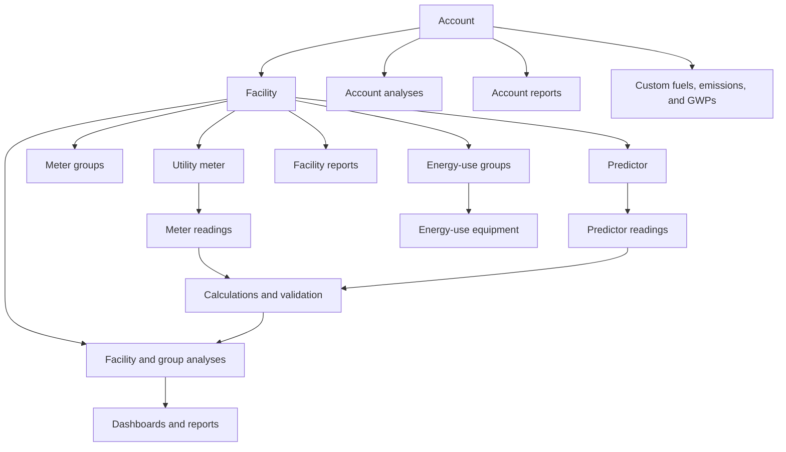

# VERIFI Architecture

This document describes the current repository. It is an orientation guide, not a proposal for a redesigned system. Follow links to source for volatile details such as package and database versions.

## System context

VERIFI is a client-focused Angular application delivered as a web application and as an Electron desktop application. Most domain data is stored locally in IndexedDB. Remote services supply weather and utility-related reference data; compute-heavy analysis and report preparation can run in Web Workers.

The Electron renderer is the same Angular application built with the Electron environment. [`main.js`](main.js) creates the desktop window, while [`preload.js`](preload.js) exposes a channel allowlist with context isolation enabled and Node integration disabled.

## Startup and application shell

[`src/main.ts`](src/main.ts) bootstraps [`AppModule`](src/app/app.module.ts). The application remains NgModule-based. `AppModule` owns startup/runtime hosts, root routing, shared utilities, and IndexedDB integration; the legacy production experience is loaded through the v0 route module.

[`ApplicationLifecycleService`](src/app/application-lifecycle/application-lifecycle.service.ts) owns idempotent startup. It opens persistence, runs versioned migrations, initializes application metadata and reference data, loads the account catalog, resolves the initial account, publishes its workspace, loads Electron metadata when applicable, and finally enables automatic-backup observation. Concurrent callers share one initialization operation; a failed operation may be retried.

Account creation and import flows activate their persisted account through the lifecycle service so catalog refresh, workspace publication, and the transition from an empty startup to ready state remain coordinated.

[`AppComponent`](src/app/app.component.ts) triggers and renders that lifecycle but does not query repositories. Its shell exposes accessible initializing, error/retry, and switching states. Application-instance metadata is lifecycle-owned readonly state; its IndexedDB service is persistence-only.

Top-level routing is composed by [`src/app/routing/app-routing.module.ts`](src/app/routing/app-routing.module.ts), with the current production route tree owned by v0 under [`src/app/v0/routing/`](src/app/v0/routing/):

- **v0 legacy experience** is lazy-loaded from [`src/app/v0/v0.module.ts`](src/app/v0/v0.module.ts). Its shell owns the current production header, legacy global modals, toast placement, and legacy route outlet while keeping existing public URLs stable.
- **P1 prototype** is kept as reference material under `src/app/ux-prototypes/` and is mounted at `/p1` only on unified-ux work.
- **v1 unified workspace** is the opt-in production redesign mounted at `/v1` only on unified-ux work.
- **Data management** handles account setup, facilities, meters, predictor data, imports, energy-use setup, and custom factors.
- **Data evaluation** handles account and facility dashboards, visualizations, analyses, and reports.
- **Weather data** provides station selection and annual or monthly observations.
- Shared routes provide the home page, account management, help, privacy, feedback, and other static content.

Account and facility route trees are intentionally large. Add legacy routes under `src/app/v0/routing/` alongside the relevant workflow and inspect adjacent components before changing navigation behavior.

Readiness guards in [`workspace-readiness.guards.ts`](src/app/routing/workspace-readiness.guards.ts) wait for persistence, account workspace, or facility selection as required. Account and facility deep links resolve GUIDs and may switch the active workspace before activation. Static help, privacy, feedback, acknowledgment, and about routes remain available without an active account, including their existing nested URLs. Existing `canDeactivate` guards remain attached to edit routes.

## Domain and persistence

Persistence is configured with `ngx-indexed-db` in [`src/app/data/indexedDB/_dbConfig.ts`](src/app/data/indexedDB/_dbConfig.ts) and registered by [`IndexedDBModule`](src/app/data/indexedDB/indexed-db.module.ts). Object-store services own persistence queries and writes only. They do not own active collections, selections, navigation, notifications, local-storage hints, or Electron orchestration.

[`AccountWorkspaceStore`](src/app/data/account-workspace/account-workspace.store.ts) owns the active account snapshot as one private signal. Its arrays and entities are shallow-readonly. A publication replaces or patches the account workspace atomically with validated selections; consumers edit copies, persist them, and then publish one committed workspace change. Facility-scoped collections are derived from that snapshot. [`AccountWorkspaceService`](src/app/data/account-workspace/account-workspace.service.ts) loads indexed account data concurrently, validates GUID-based selections, restores or clears persisted selection hints, and uses request tokens so stale account switches cannot publish.
Feature code reads account-scoped state only through workspace signals and changes selections through `AccountWorkspaceService`. All durable account-workspace writes are routed through [`WorkspaceCommandBoundary`](src/app/data/account-workspace/workspace-command-boundary.service.ts), which coordinates validation, persistence via domain handlers, one committed workspace publication, and one committed-change event per user operation. The boundary reloads committed workspace data by default after persistence; patch publication is opt-in and must be explicitly supplied only when the caller can provide a complete affected-record patch. Domain handlers in [`src/app/data/account-workspace/handlers/`](src/app/data/account-workspace/handlers/) are the only non-infrastructure callers of repository write methods. Components and feature services must not call repository write methods directly; the architecture-enforcement test in [`src/app/data/indexedDB/architecture-enforcement.spec.ts`](src/app/data/indexedDB/architecture-enforcement.spec.ts) enforces this invariant.

See [Working with application data](docs/data-access-and-workspace.md) for developer-facing decision guidance and examples for reading, editing, selecting, persisting, refreshing, and testing account-scoped data.

Ordinary single-store access uses `ngx-indexed-db`. Atomic operations spanning multiple stores use the internal native transaction adapter in [`indexed-db-transaction.service.ts`](src/app/data/indexedDB/indexed-db-transaction.service.ts). Transaction operations must use only the adapter's transaction-bound request context; calling an object-store service from inside the operation would open an unrelated transaction.

Account and facility removal are infrastructure-owned cascades in [`indexed-db-cascade-delete.service.ts`](src/app/data/indexedDB/indexed-db-cascade-delete.service.ts). Every participating store and retained-reference update must remain inside its declared native transaction; the account catalog and active workspace are refreshed only after that transaction commits.

Persisted records generally have an IndexedDB `id` used as the local key and a `guid` used for domain relationships. Account and facility GUIDs connect records across stores. Preserve that distinction in queries, imports, migrations, and deletes.

There are two independent forms of persistence evolution:

- **Structural schema changes** update `_dbConfig.ts`. Adding or changing a store or index requires an intentional database-version increment and an upgrade-path test.
- **Record-shape migrations** use `CURRENT_DATA_VERSION` and the ordered pure registry described in the [`data-migrations` guide](src/app/data/indexedDB/data-migrations/README.md). The local runner commits each migration and application metadata in one native transaction before startup publishes persisted records. Current-version data is not rewritten.

Test both an empty database and representative older data. Consider JSON backup import/export whenever persisted shapes change.

## Calculations, Workers, and reports

Pure TypeScript calculations live under [`src/app/domain/calculations`](src/app/domain/calculations). Major groups cover calendarization, analyses, conversions, emissions, energy footprints, dashboards, savings, performance reports, and validation/status checks. Analysis calculation helpers that still sit outside `domain` live under [`src/app/shared/shared-analysis/calculations`](src/app/shared/shared-analysis/calculations); v0-only analysis tables, graphs, and validation display components live under `src/app/v0/shared/shared-analysis/`.

Compute-heavy operations use workers under [`src/app/platform/web-workers`](src/app/platform/web-workers). [`run-worker.ts`](src/app/platform/web-workers/run-worker.ts) wraps a Worker in an RxJS observable, posts one structured-cloneable payload, emits one result or error, and terminates the worker during teardown. Each worker imports calculation code and owns its request/result contract.

When changing calculation inputs or outputs:

1. Update the pure calculation and deterministic unit tests.
2. Find synchronous services, components, Workers, and report writers that consume it.
3. Update every affected Worker payload, response, and error path.
4. Verify units, site/source assumptions, date boundaries, missing data, rounding, and aggregation levels.
5. Use a browser test when the Worker boundary changes.

Reports are assembled in account and facility report features under `src/app/v0/data-evaluation/`. Outputs include rendered/printable views and, depending on the report, Excel, PDF, or PowerPoint files. Keep on-screen totals and exported totals aligned with their shared calculation source.

## Imports, exports, and backups

Spreadsheet upload begins in [`data-management-import`](src/app/v0/data-management/data-management-import). The upload component reads workbooks with SheetJS, then routes known templates to version-specific parsers and other workbooks through mapping workflows. Template versions and external formats are compatibility boundaries, not redundant code to consolidate casually.

Excel exports primarily use ExcelJS. [`export-to-excel-template-v3.service.ts`](src/app/shared/helper-services/export-to-excel-template-v3.service.ts) writes the current VERIFI data template, while report-specific writers produce program and analysis workbooks. Template spreadsheets under `src/assets/csv_templates/` are binary source artifacts whose sheet names, headers, types, formulas, and ordering may be part of the import contract.

JSON backup assembly is centered under [`src/app/data/backup/`](src/app/data/backup). [`BackupExportCoordinator`](src/app/data/backup/backup-export-coordinator.service.ts) is the single browser/manual export entry point. It reads one coherent account-workspace snapshot, delegates backup shaping to [`WorkspaceBackupSnapshotBuilder`](src/app/data/backup/backup-snapshot-builder.service.ts), and delivers JSON or ZIP output through [`JsonBackupSerializer`](src/app/data/backup/backup-serializer.service.ts) plus the browser download service. Inactive-account exports load a readonly snapshot through [`AccountWorkspaceLoaderService`](src/app/data/account-workspace/account-workspace-loader.service.ts) without switching the active workspace.

Automatic Electron backups are coordinated by [`AutomaticBackupsService`](src/app/platform/electron/automatic-backups.service.ts). It observes committed workspace revisions only, so hydration and selection-only changes do not save. Account switches cancel unsent work for the previous account. Committed bursts retain the debounce and queue one follow-up save when a newer committed revision lands during an active write. Backup file existence, reads, and recoverable writes go through the request/response [`ElectronBackupFileGateway`](src/app/platform/electron/electron-backup-file.gateway.ts) instead of renderer-main event subjects.

Electron conflict reconciliation compares the file `dataBackupId` against the persisted `electronBackups` registry. Missing files, invalid files, and future-version files are surfaced once per account session through the coordinator. Archive writes are built from snapshots and written through the gateway without mutating the account record inside the backup payload.

Every JSON restore path first clones and prepares the file through [`backup-preparation.service.ts`](src/app/data/backup/backup-preparation.service.ts): validate the envelope and data version, run the same ordered migrations as local data, validate core GUID relationships, then remap GUIDs and persist. [`BackupImportCoordinator`](src/app/data/backup/backup-import-coordinator.service.ts) is the single coordinated restore entry point for account import, facility import, replacement, selective facility import, example-data loading, and Electron conflict flows. Missing version metadata means version `0`; future versions are rejected before replacement or import mutation.

See [Backup workflows and services](docs/data-access-and-workspace.md#backup-workflows-and-services) for developer-facing service responsibilities and the expected manual, restore, and automatic Electron backup flows. For import/export changes, define compatibility before editing, keep parsers pure where possible, and verify a representative round trip from import through persistence to export.

## Web and Electron boundary

Environment replacement is configured in [`angular.json`](angular.json):

- Development uses local/proxied API settings.
- Development-server and production builds use deployed service URLs.
- Electron uses production services and hash-based routing suitable for `file://` URLs.

[`ElectronService`](src/app/platform/electron/electron.service.ts) detects `window.electronAPI` and guards renderer calls when the bridge is unavailable. `preload.js` allowlists renderer-to-main and main-to-renderer channels. `main.js` owns desktop windows, filesystem access, dialogs, external links, and updates.

Preserve these invariants:

- Browser behavior must not assume the Electron bridge exists.
- Electron changes must update the main handler, preload allowlist, renderer wrapper, and cleanup/listener behavior together.
- Do not weaken context isolation or expose raw Node/Electron APIs to the renderer.
- Shared renderer changes should build for both production web and Electron targets.

## UI architecture

VERIFI uses Bootstrap, ng-bootstrap, Font Awesome, Angular templates, and Plotly. Legacy v0 feature components live under `src/app/v0/` and own their local templates and styles. Version-neutral helpers and contracts live under `src/app/shared/` and should be imported with `@shared/*`; v0-only reusable UI lives under `src/app/v0/shared/` and should be imported with `@v0/shared/*`. Current v0 shared UI includes legacy helper pipes, spinners, table/dropdown helpers, labels, meter content, data-quality displays, analysis presentation widgets, report widgets, settings/help UI, and similar presentation bundles. Do not import from `@v0/*` in root shared, data, domain, platform, or future v1 code. Global style layers live under [`src/styles`](src/styles) and cover tables, forms, navigation, reports, printing, Plotly, and other cross-feature patterns.

Shared notification state lives under [`src/app/shared/notifications`](src/app/shared/notifications), while v0 owns the visual toast host under `src/app/v0/core-components/toast-notifications/`. Meter charge option types and constants live under [`src/app/data/models/meter-charges-options.ts`](src/app/data/models/meter-charges-options.ts) so persisted models, migrations, exports, and v0 forms use the same contract without importing legacy UI.

The current production UI is treated as v0 and is lazy-loaded through `src/app/v0/`. The root `AppComponent` owns startup, lifecycle, root routing, and app-wide runtime overlays only; v0 owns the legacy header, legacy route outlet, and legacy UI modals. Future v1 production UI should use a separate lazy-loaded route module rather than adding v0/v1 conditionals to legacy components.

The unified UI/UX migration keeps the current experience as v0 and adds the new opt-in experience under `/v1`. v0 and v1 should have separate UI components and route shells. Shared data services, models, calculations, backups, imports, exports, Web Workers, and Electron boundaries remain outside versioned UI folders unless a dedicated compatibility issue changes those contracts. See the [Unified UI/UX migration guide](docs/unified-ux/migration-guide.md) for the lightweight migration decision process.

Use neighboring screens as the primary visual reference. Reuse shared components and existing classes before adding global rules. UI work should account for:

- Dense industrial data, long labels, wide tables, charts, and unit-bearing values.
- Responsive browser layouts and the Electron window.
- Loading, empty, validation, error, disabled, and success states.
- Keyboard operation, visible focus, semantic labels, contrast, and screen-reader announcements.
- Print and report styles when a changed component can appear in generated output.

The repository does not define a separate design system. Do not introduce one implicitly as part of a feature issue.

## Tests, builds, and delivery

Test targets are configured in `angular.json` and exposed through `package.json`:

- Vitest with jsdom runs ordinary `*.spec.ts` tests.
- Playwright with Chromium runs `*.browser.spec.ts` tests for IndexedDB, Web Workers, and other browser-native behavior.
- `npm run test:all:ci` runs both suites.

The current GitHub workflow runs on pushes to `master` and `develop`, plus manual dispatch. Tests gate the downstream QA, web, and desktop jobs. Web deployment builds `develop` for development and `master` for production. Desktop packaging runs for `master` and creates platform installers through Electron Builder.

Agents and contributors must run the relevant local checks before opening a pull request; do not assume a pull-request event will run the workflow.

Build artifacts belong in `dist/` and installers in `output/`. Neither directory is source.

## Architectural change checklist

- Confirm the behavior from source before documenting it.
- Preserve browser and Electron boundaries.
- Preserve persisted-data and file-format compatibility or document an approved break.
- Update all consumers of shared calculations and Worker contracts.
- Match the repository's current Angular and UI patterns.
- Add the correct unit or browser coverage.
- Update this document when a boundary, data flow, or invariant changes.
